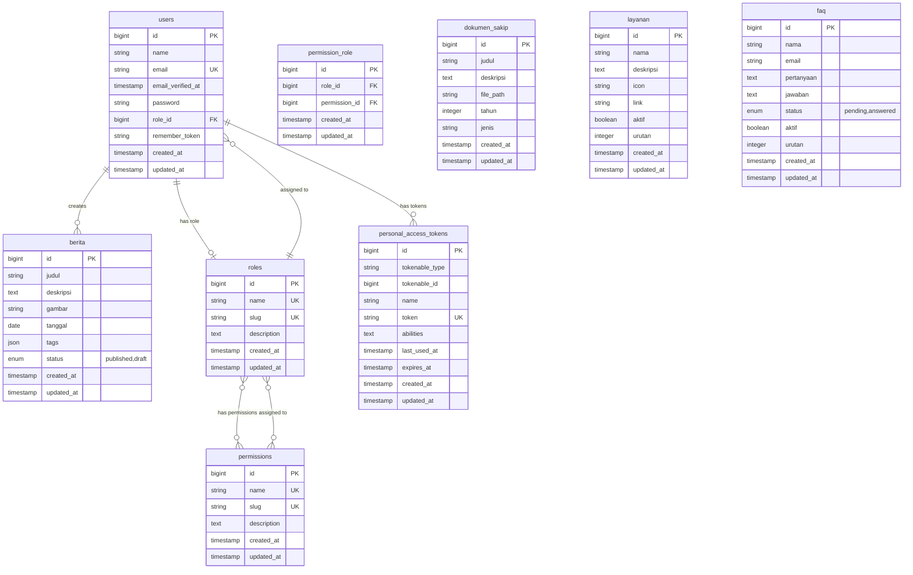
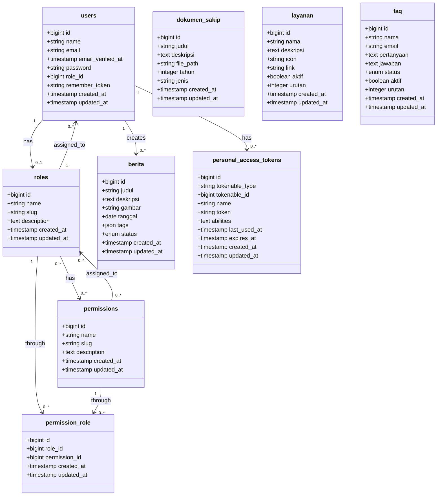

# Database ERD - Diskominfo Kab. Pemalang

## ERD Mermaid (Entity Relationship Diagram)

---

## Alternative: Class Diagram Style (Lebih Detail)

---

## Cara Menggunakan:

1. **Mermaid Live Editor**: https://mermaid.live
   - Copy code di atas
   - Paste ke editor
   - Download sebagai PNG/SVG

2. **Draw.io untuk Chen Notation**:
   - Buka https://app.diagrams.net
   - Pilih template "Entity Relation"
   - Buat manual dengan style Chen (oval + diamond)

3. **ERDPlus** (Recommended untuk Chen):
   - Buka https://erdplus.com
   - Buat ERD dengan Chen Notation
   - Export sebagai gambar

---

## Tabel Relationships:

| From | To | Type | Description |
|------|-----|------|-------------|
| users | roles | Many-to-One | User has one role |
| users | berita | One-to-Many | User creates many berita |
| users | personal_access_tokens | One-to-Many | User has many tokens |
| roles | permissions | Many-to-Many | Role has many permissions |
